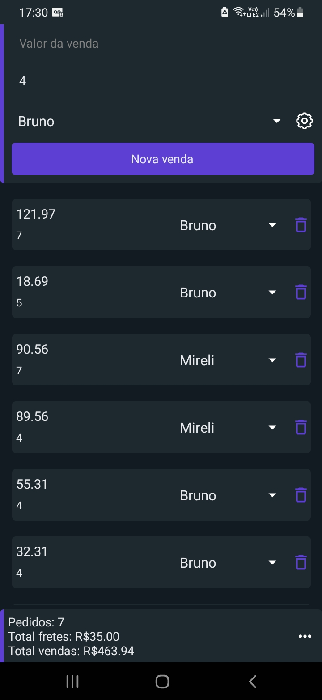
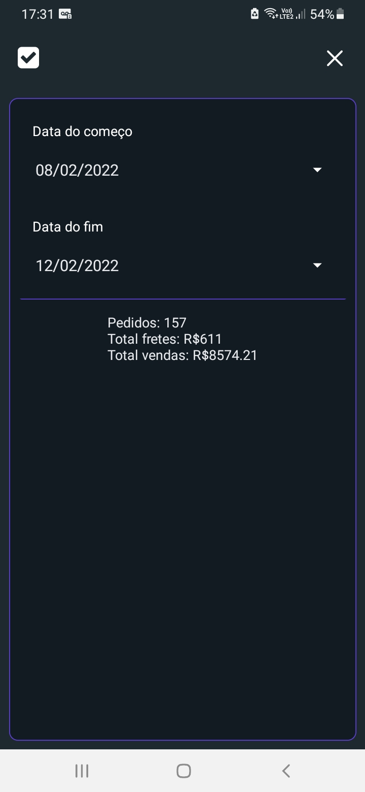
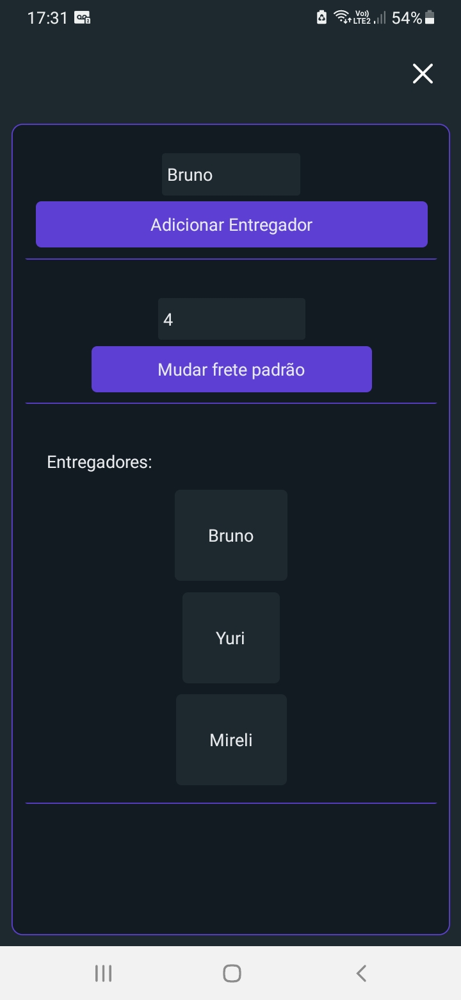

<h1>Job Helper</h1>

<h2>It has been helping me save 30 minutes everyday at work, which compounds to 14 hours per month.</h2>

An highly customized React Native app created to help me salve some time at work.

Helps me with a simple and repetitive task: generate daily sales report.

The report has to show:

<ul>
    <li>Who delivered and how much money they made</li>
    <li>The number of sales that day</li>
    <li>The number of sales weekly and monthly</li>
    <li>How much money was made in certain period of time</li>
</ul>

 
 

<h1>Overview of the app</h1>

